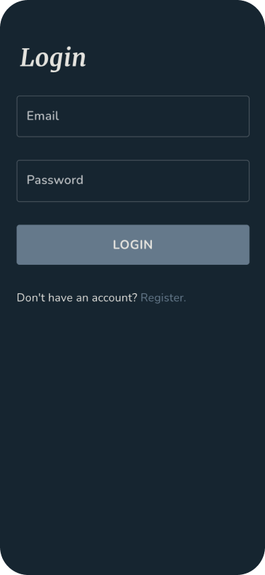

<!-- PROJECT SHIELDS -->
<!--
*** I'm using markdown "reference style" links for readability.
*** Reference links are enclosed in brackets [ ] instead of parentheses ( ).
*** See the bottom of this document for the declaration of the reference variables
*** for contributors-url, forks-url, etc. This is an optional, concise syntax you may use.
*** https://www.markdownguide.org/basic-syntax/#reference-style-links
-->
[![Contributors][contributors-shield]][contributors-url]
[![Forks][forks-shield]][forks-url]
[![Stargazers][stars-shield]][stars-url]
[![Issues][issues-shield]][issues-url]
[![MIT License][license-shield]][license-url]

<!-- PROJECT LOGO -->
 

  

  <h3 align="center">My Neck of the Woods</h3>

  

    A community web app for your local apartement building, housing cooperative or residential unit. Get to know your neighbors!
     
    <a href="https://github.com/stenwall/u11-fullstack-js-stenwall"><strong>Explore the docs »</strong></a>
     
     
    <a href="https://u11.vercel.app/">View Demo</a>
    ·
    <a href="https://github.com/chasacademy/u11-fullstack-js-stenwall/issues">Report Bug</a>
    <!-- ·
    <a href="https://github.com/stenwall/u11-fullstack-js-stenwall/issues">Request Feature</a> -->
  

<!-- TABLE OF CONTENTS -->

  
<h2 style="display: inline-block">Table of Contents</h2>

  <ol>
    <li>
      <a href="#about-the-project">About The Project</a>
      <ul>
        <li><a href="#built-with">Built With</a></li>
        <li><a href="#the-assignment">The Assignment</a></li>
      </ul>
    </li>
    <li>
      <a href="#getting-started">Getting Started</a>
      <ul>
        <li><a href="#prerequisites">Prerequisites</a></li>
        <li><a href="#installation">Installation</a></li>
      </ul>
    </li>
    <li><a href="#usage">Usage</a></li>
    <li><a href="#roadmap">Roadmap</a></li>
    <li><a href="#contributing">Contributing</a></li>
    <li><a href="#license">License</a></li>
    <li><a href="#contact">Contact</a></li>
    <li><a href="#acknowledgements">Acknowledgements</a></li>
  </ol>

<!-- ABOUT THE PROJECT -->
## About The Project

  
  
  
  
  
  

### The Assignment

School Assignment @ Chas Academy, class FWD20

---

>The goal of this assignment is to demonstrate that you can single-handedly take your knowledge and skills and go from idea and concept to a full application. Your project should demonstrate understanding and use of a RESTful API in Node with JWT-based authentication using MongoDB document database.

### Built With

* [Next.js](https://nextjs.org/)
* [Node.js](https://nodejs.org/en/)
* [Express](https://expressjs.com/)
* [MUI](https://mui.com/)
* [SCSS](https://sass-lang.com/)

## Design

Below are some of the design documents for the assignment.

### Wireframes

  
  
  
  

 

  
  
  
  

### Sitemap

<!-- LICENSE -->
## License

Distributed under the MIT License. See `LICENSE` for more information.

<!-- MARKDOWN LINKS & IMAGES -->
<!-- https://www.markdownguide.org/basic-syntax/#reference-style-links -->
[contributors-shield]: https://img.shields.io/github/contributors/chas-academy/u11-fullstack-js-stenwall.svg?style=for-the-badge
[contributors-url]: https://github.com/chas-academyl/u11-fullstack-js-stenwall/graphs/contributors
[forks-shield]: https://img.shields.io/github/forks/chas-academy/u11-fullstack-js-stenwall.svg?style=for-the-badge
[forks-url]: https://github.com/chas-academy/u11-fullstack-js-stenwall/network/members
[stars-shield]: https://img.shields.io/github/stars/chas-academy/u11-fullstack-js-stenwall.svg?style=for-the-badge
[stars-url]: https://github.com/chas-academy/u11-fullstack-js-stenwall/stargazers
[issues-shield]: https://img.shields.io/github/issues/chas-academy/u11-fullstack-js-stenwall.svg?style=for-the-badge
[issues-url]: https://github.com/chas-academy/u11-fullstack-js-stenwall/issues
[license-shield]: https://img.shields.io/github/license/chas-academy/u11-fullstack-js-stenwall.svg?style=for-the-badge
[license-url]: https://github.com/chas-academy/u11-fullstack-js-stenwall/blob/master/LICENSE.txt
[linkedin-shield]: https://img.shields.io/badge/-LinkedIn-black.svg?style=for-the-badge&logo=linkedin&colorB=555
[linkedin-url]: https://linkedin.com/in/karin-stenwall